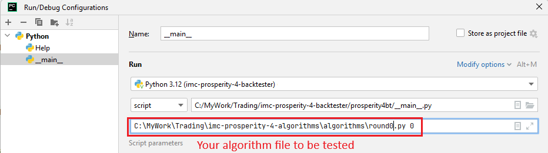
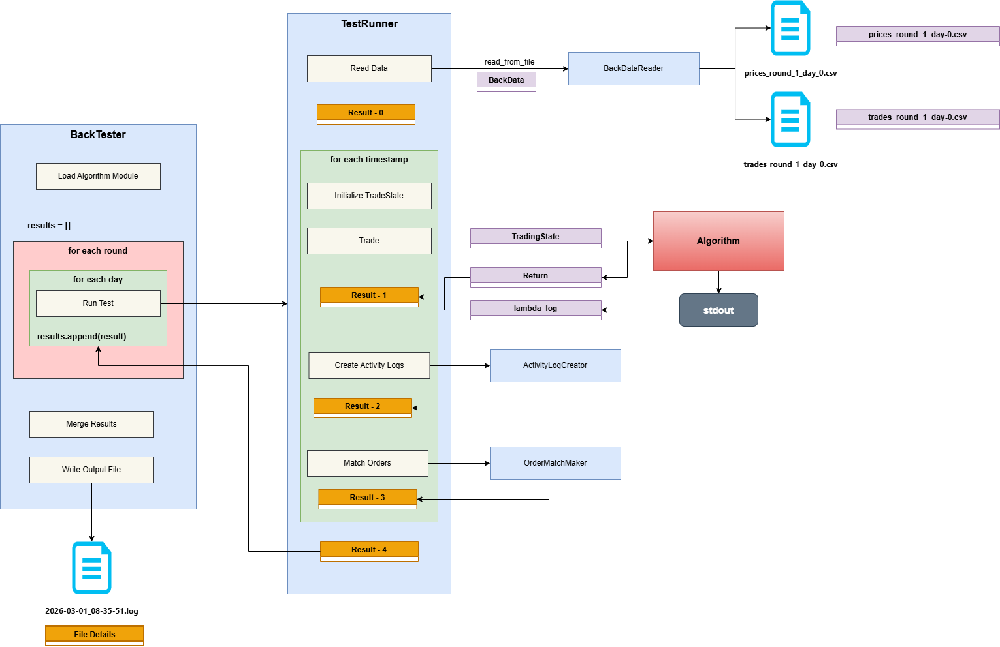
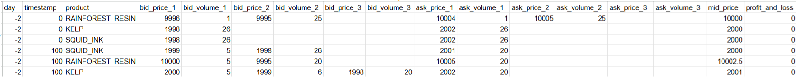
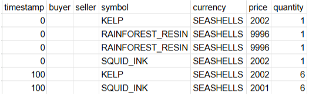
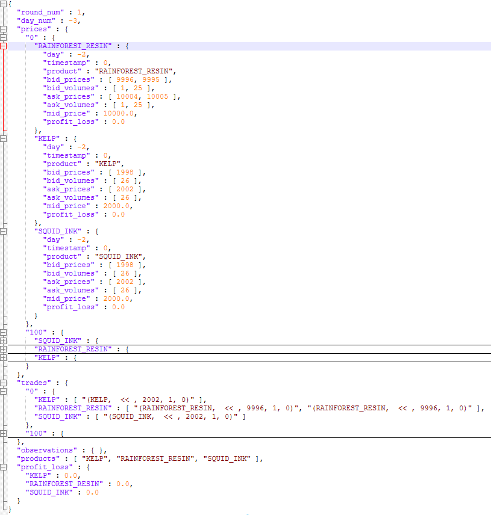
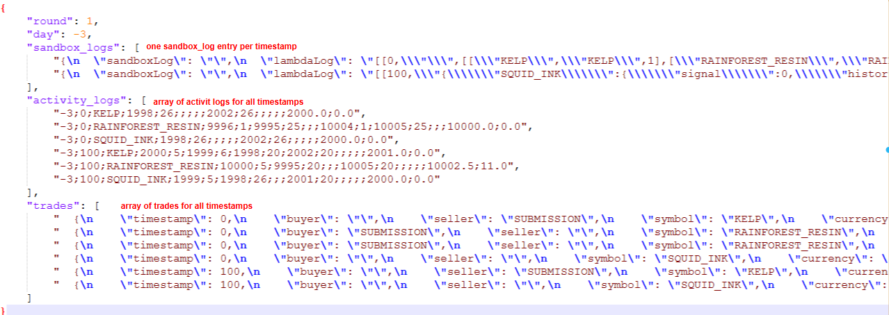
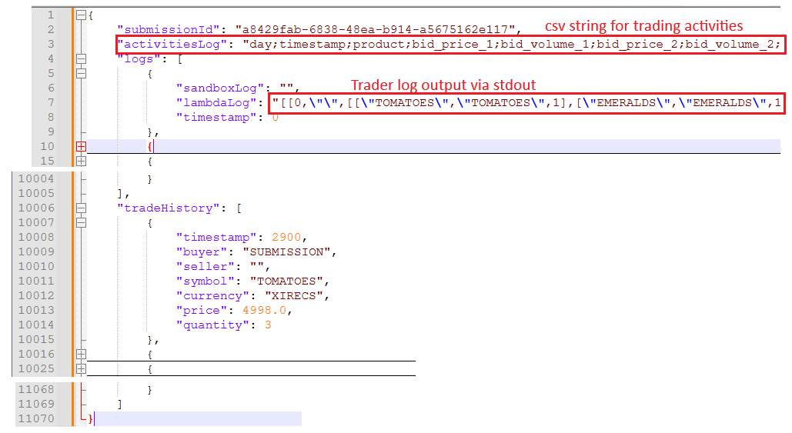

# IMC Prosperity 4 Backtester

This repository contains a Python-based backtester designed in preparation for the [IMC Prosperity 4 challenge](https://prosperity.imc.com/). 

**Key Notes:**
* **Origin:** This project is heavily based on [jmerle/imc-prosperity-3-backtester](https://github.com/jmerle/imc-prosperity-3-backtester), but it has been rewritten to utilize a more Object-Oriented Programming (OOP) style. 
* **Current Status:** The codebase is up to date with the Prosperity 4 tutorial round.
* **License:** MIT License.

---

**Usage:**

**Basic usage:**

Run the backtester on an algorithm using all data from round 0
```bash
 $ python -m prosperity4bt <path to algorithm file> 0
 ```

Run the backtester on an algorithm using all data from round 0, day '-2'
```bash
 $ python -m prosperity4bt <path to algorithm file> 0--2
 ```

If you see: `No module named 'datamodel'`, set PYTHONPATH to the folder containing datamodel.py:  
```bash
 $env:PYTHONPATH="<path to>\imc-prosperity-4-backtester\prosperity4bt"
```

**Run/Debug from Pycham**

Add Run/Debug Configuration:


---
## Overall Structure & How It Works

The architecture of the program is modularized to cleanly separate data loading, simulation execution, and order matching. Below is the structural diagram of the backtester:



### Component Breakdown & Execution Flow

Based on the architecture diagram, the system operates through the following primary components and execution steps:

#### 1. The `BackTester` (Main Controller)
This is the top-level driver of the simulation:
* **Initialization:** It begins by executing the `Load Algorithm Module` step to ingest your trading logic.
* **Iteration:** It initializes an empty `results = []` list and iterates through a nested loop: `for each round` and `for each day`. For every day, it executes the `Run Test` function, which calls the `TestRunner`. It then appends the output to the `results` list.
* **Completion:** Once all rounds and days are processed, it calls `Merge Results` to combine the data and triggers `Write Output File` to produce a consolidated log (e.g., `2026-03-01_08-35-51.log` containing trading results).

#### 2. The `TestRunner` (Daily Simulator)
The `TestRunner` is responsible for simulating the market environment for a single day:
* **Read Data:** It triggers `Read Data` which calls the `BackDataReader` to read the market data from 2 csv files (price and trade). The reader parses the files (e.g.`prices_round_1_day_0.csv` and `trades_round_1_day_0.csv`) and returns a `BacktestData` object. This step yields `Result - Stage 0`.
* **Timestamp Loop:** For each timestamp in the loaded data (`for each timestamp`), the runner executes a sequence of events:
    1. **Initialize TradeState:** Prepares the current state of the market.
    2. **Trade:** Creates a `TradingState` object and passes it into the user's `Algorithm`. 
    3. **Algorithm Execution:** The user's `Algorithm` processes the state and returns proposed orders and a string as `TraderData`. Any standard output (`stdout`) generated by the algorithm is captured as `lambda_log`. This execution step yields `Result - Stage 1`.
    4. **Create Activity Logs:** The `ActivityLogCreator` steps in to record the actions, orders, and market state of the current timestamp. This yields `Result - Stage 2`.
    5. **Match Orders:** The proposed orders are passed to the `OrderMatchMaker`, which simulates the exchange mechanics to fill orders against the historical order book. This yields `Result - Stage 3`.
* **Results Aggregation:** After the timestamp loop concludes, the overall day's simulation yields `Result - Stage 4`, which is returned back to the `BackTester`.

#### 3. Core Helper Modules
* **`BackDataReader`:** Handles the file ingestion of CSV price and trade data into programmatic objects.
* **`ActivityLogCreator`:** Responsible for standardizing and formatting the activity logs for later analysis and debugging.
* **`OrderMatchMaker`:** The internal simulation engine that determines which algorithm orders execute and updating positions.
## Explanation of Data Models

The backtester relies on a specific set of data models to process market information and log simulation results cleanly. 

* **`datamodel.py`**: This file contains the core data models that are shared between the `BackTester` and your custom `Algorithm`. **(Please do not change this file)**. Modifying it may break compatibility with the official Prosperity environment.
* **`models/` directory**: The models located within the `models` folder are specifically defined for the internal operations of the `BackTester`.
* **Input Data Models (`models/input.py`)**: This file defines the models that capture the raw market data from the input files. During the setup phase, data is extracted from the price data files and trade data files:

  **Price Data:**
  
  

  **Trade Data:**
  
  

  This raw data is then structured and filled into the `BacktestData` model, which acts as the data source for the simulation:

  **Backtest Data:**
  
  

* **Result Data Models (`models/output.py`)**: Models defined here are responsible for capturing the test result data generated during the simulation. 
  
  Once the backtest is complete, the system compiles the findings into a `BacktestResult` object:

  **Backtest Result:**
  
  

  Finally, this structured result data is written directly into the standard output log file so you can review your algorithm's performance and activities:

  **Output Log File:**
  
  
